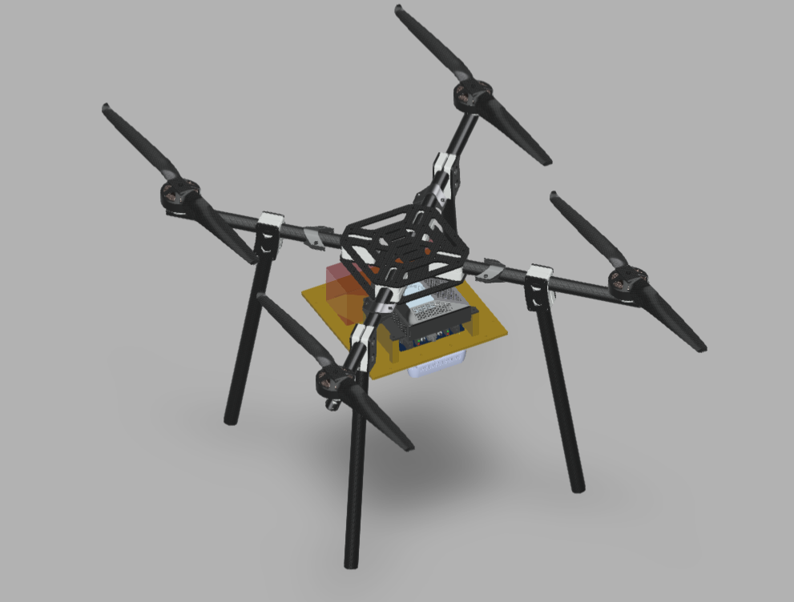
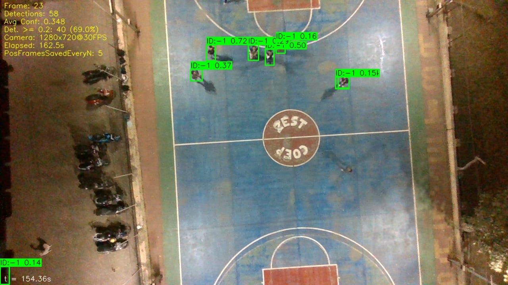
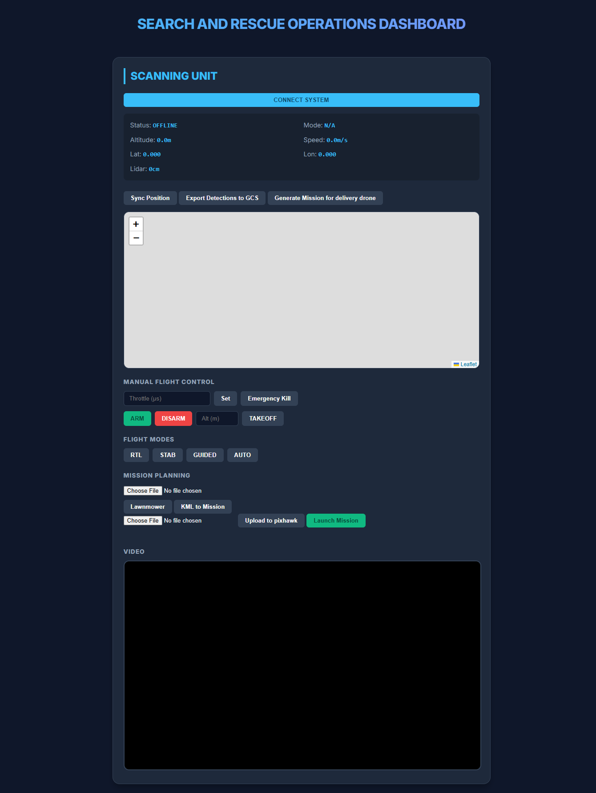

<div align="center">

# AI-Powered Search & Rescue Drone Swarm

**Smart India Hackathon 2026 · Problem Statement ID: 26177 · Qualcomm Inc.**


</div>

---

## Problem Statement

> *"A deployable AI-powered autonomous drone that aids search-and-rescue operations by detecting people and hazards, thereby improving responder safety and reducing victim discovery time."*

**PS ID:** 26177 · **Sponsor:** Qualcomm Inc. · **Category:** Hardware / AI / Robotics

---

## Overview

Disaster sites are dangerous to search on foot and slow to search manually. This project deploys a **swarm of autonomous drones** that fly a coverage pattern over a search area, detect **people and hazards** in real time using onboard AI, geo-tag every detection, and stream a **live, risk-scored map** to a ground dashboard — so responders know exactly where to go and what to avoid before they set foot on site.

**Core outcomes:**
- Faster victim discovery through parallel, autonomous aerial search
- Improved responder safety via early hazard flagging (fire, structural collapse, gas leaks, etc.)
- A live, shared operational picture for command teams — not a post-mission report

---

## Key Features

- **Swarm-ready** — scales from 1 drone to N without architecture changes
- **RGB + thermal fusion** — detects people through smoke, darkness, and light debris
- **On-edge AI detection** — YOLO-based detection for both people and hazard classes
- **Precision geo-tagging** — reverse transform matrix converts pixel detections to GPS coordinates using drone altitude, attitude, and camera calibration
- **Dynamic coverage planning** — re-tasks drones live as new detections come in, instead of a fixed flight plan
- **Live ops dashboard** — real-time multi-drone map for responders, not a batch report

---

## System Architecture

```
Field Ops Server → Drone Swarm → Camera (RGB + Thermal)
                                        │
                        ┌───────────────┴───────────────┐
                        ▼                                ▼
                Object Detection                 Geo-tag Generation
                  (YOLO model)                (reverse transform matrix)
                        └───────────────┬───────────────┘
                                        ▼
                              Waypoint Generation (CSV)
                                        ▼
                            Coverage Path Planning
                              (dynamic re-tasking)
                                        ▼
                              SAR Ops Server (live map)
```

> Replace this section with the exported architecture diagrams — add them to `assets/architecture/` and embed below:
> ```markdown
> 
> 
> ```

---

## Tech Stack

| Layer | Technology |
|---|---|
| **Flight compute** | Jetson Orin Nano |
| **Flight controller / firmware** | Pixhawk Orange Cube + ArduPilot |
| **AI detection** | YOLO-V8 (people + hazard classes) |
| **Sensors** | RGB camera + thermal camera, GPS/IMU |
| **Middleware / comms** | MAVLink |
| **Simulation & testing** | ArduPilot SITL, OpenCV |
| **Ground software** | Flask Based Field Ops Server, SAR Ops Server (live dashboard) |
| **Data format** | CSV / waypoint files, geo-tagged detections |

---

## Repository Structure

```
├── models/
│   ├── assemblies/      # Drone Assembly
│   ├── parts/           # Drone Parts
├── GCS_files/           # SAR ops dashboard
│   ├── static/          # Static Files
│   ├── templates/       # Template files
│   └── main.py          # Flask Launcher
├── assets/
│   ├── architecture/    # Architecture diagrams
│   ├── photos/          # Hardware & field test photos
│   └── videos/          # Demo videos
└── README.md
```


## Demo

### Videos

<!--
GitHub renders video previews only for files uploaded through its own
drag-and-drop uploader (in an issue/PR/release), which generates a
githubusercontent.com link. Drop your .mp4 into a new issue comment,
copy the generated link, and paste it below — it will render inline.
-->

| Demo | Description |
|---|---|
| _[Add video link here]_ | Full mission run — takeoff to live map |
| _[Add video link here]_ | Hazard detection close-up |
| _[Add video link here]_ | Multi-drone coverage re-tasking |

### Photos

<p align="center">
  
  
  
</p>

*(Add your images to `assets/photos/` and update the filenames/captions above.)*

---

## How This Solves PS 26177

| Requirement | Our Solution |
|---|---|
| Deployable | Swarm-ready, single-drone-to-N scaling, no ground infrastructure required beyond the field ops server |
| Detects people | RGB + thermal fusion with YOLO detection |
| Detects hazards | Multi-class detection extended to fire, structural collapse, gas leaks, etc. |
| Improves responder safety | Drone scouts hazardous terrain before responders enter |
| Reduces victim discovery time | Autonomous coverage planning + live geo-tagged detections vs. manual grid search |

---

## Team

| Name | Role |
|---|---|
| Krishna Khilare | Team Captain |
| Shreyash Kadam | Vice Captain |
| Vishnu Waghmare | Team Member |
| Devansh Dwivedi | Team Member |
| Abhinav Kumbhar | Team Member |
| Vinisha Mudaliar | Team Member |

**Institution:** COEP Technological University, Pune

---

## Acknowledgements

- Smart India Hackathon 2026
- Qualcomm Inc. — Problem Statement 26177

---

<div align="center">

*Built for SIH 2026*

</div>
